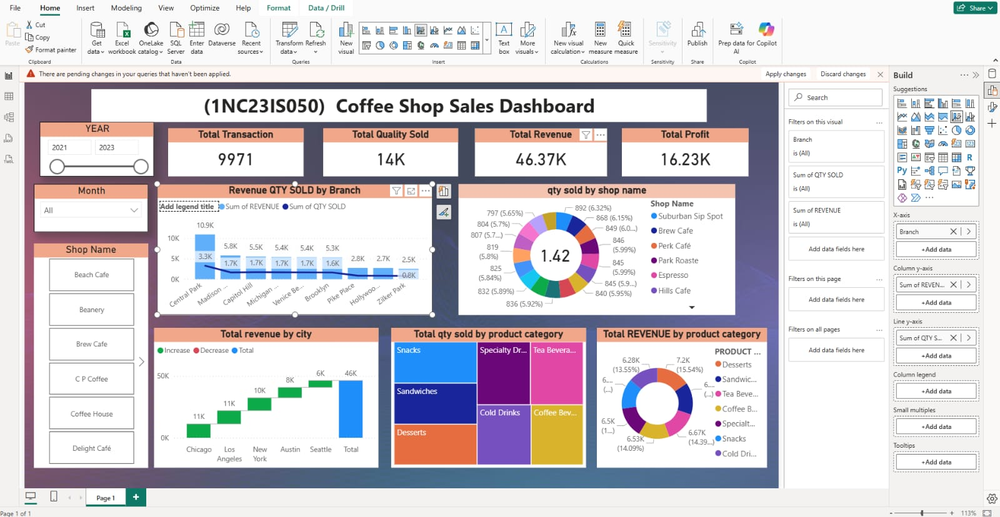

# ☕ Coffee Shop Sales Dashboard

## 📊 Overview  
This project is an interactive **Power BI dashboard** built using the Coffee Shop Sales dataset. It helps analyze sales performance, revenue, and product trends.

## 🚀 Features  
- KPI Cards: Total Transactions, Quantity, Revenue, Profit  
- Slicers: Year, Month, Shop Name  
- Visualizations:  
  - Revenue & Quantity by Branch  
  - Revenue by City  
  - Quantity by Product Category  
  - Category-wise Revenue & Shop-wise Quantity  

## 🛠 Tools Used  
- Power BI  
- Power Query  
- DAX  

## 📷 Output Screenshot  

## 📌 Purpose  
To create a clean and interactive dashboard for analyzing coffee shop sales data.

## 👨‍💻 Author  
**Roshan Gowda**
